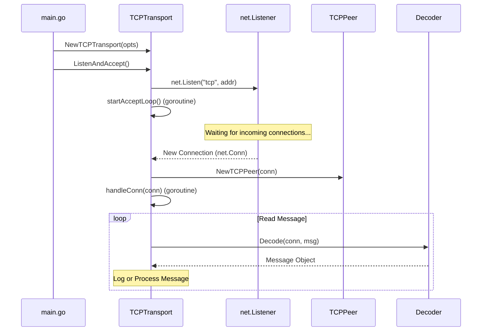

# AstraStore Architecture & Data Flow

Welcome to the **AstraStore** technical documentation. This document provides a high-level overview of the system's architecture and the execution flow from the entry point to the networking layer.

---

## 🏗️ System Overview

AstraStore is a distributed storage engine designed for high scalability and reliability. At its core, it utilizes a peer-to-peer (P2P) networking layer to facilitate communication between distributed nodes.

---

## 🚀 Execution Flow: Main Entry Point

The journey begins in `main.go`. This file is responsible for bootstrapping the server and initializing the transport layer.

### 1. Configuration & Initialization
The `main()` function defines the settings for our transport layer using `TCPTransportOpts`.

```go
tcpOpts := p2p.TCPTransportOpts{
    ListenAddr:    ":3000",
    HandshakeFunc: p2p.NOPHandshakeFunc,
    Decoder:       p2p.DefaultDecoder{},
}
tr := p2p.NewTCPTransport(tcpOpts)
```

- **ListenAddr**: The local address the node will bind to.
- **HandshakeFunc**: A logic gate for new connections (currently a No-Op).
- **Decoder**: The mechanism used to interpret raw bytes into structured messages.

### 2. Launching the Transport
Once initialized, `ListenAndAccept()` is called. This starts the underlying TCP listener and transitions the system into an "active" state where it can receive connections.

---

## 📡 The P2P Networking Layer (`/p2p`)

The networking layer is the backbone of AstraStore. It handles everything from socket management to message decoding.

### 1. `TCPTransport` & `TCPPeer`
- **TCPTransport**: Manages the lifecycle of connections and the listener.
- **TCPPeer**: Represents a single connection to a remote node.

### 2. The Connection Loop (`startAcceptLoop`)
The transport runs an infinite loop that waits for new TCP connections. For every new connection:
1. A new `TCPPeer` instance is created.
2. The `HandshakeFunc` is executed to validate the connection.
3. If successful, a dedicated `handleConn` goroutine is spawned to manage that specific peer.

### 3. Data Processing (`handleConn`)
Inside `handleConn`, the node enters a read loop. It uses the configured **Decoder** to pull data off the wire.

```go
for {
    if err := t.Decoder.Decode(conn, msg); err != nil {
        // Handle error and break loop
    }
    // Process the decoded message
}
```

---

## 🛠️ Components Detail

### 🧩 Encoding & Decoding (`encoding.go`)
- **Decoder Interface**: Defines how data is read from an `io.Reader`.
- **DefaultDecoder**: Performs a simple byte read (buffered at 1024 bytes).
- **GOBDecoder**: Utilizes Go's native serialization for more complex data structures.

### 🤝 Handshaking (`handshake.go`)
The handshake process ensures that the peer we are connecting to is compatible and authorized.
- **NOPHandshakeFunc**: A placeholder for development that allows all connections.

---

## 📊 Interaction Diagram



---

## 🔜 Future Roadmap
- [ ] **Peer Discovery**: Implementing DHT or static peer lists.
- [ ] **State Management**: Persisting peer information in the `peers` map.
- [ ] **Encryption**: Adding TLS support to the TCP transport.
- [ ] **Storage Layer**: Integrating the actual storage engine with the P2P layer.
